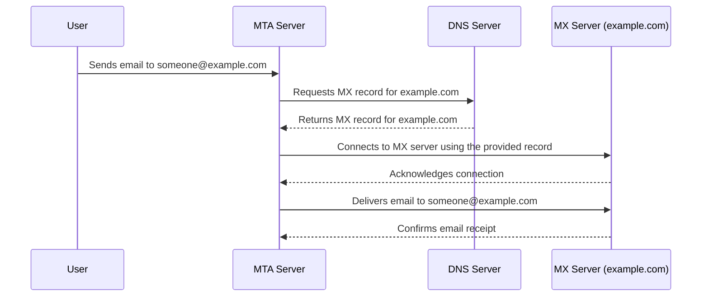

Mail Exchange (MX) is the "incoming" email server that accepts emails on behalf of a specific domain name using the SMTP protocol.

The MX server for a domain is resolved using DNS, and the MX server always runs on port 25.

- `gmail-smtp-in.l.google.com` for `gmail.com`
- `example-slug.mail.protection.outlook.com` for `example.com` using MS365
- `inbound-smtp.eu-west-1.amazonaws.com` for AWS Workmail
- etc

