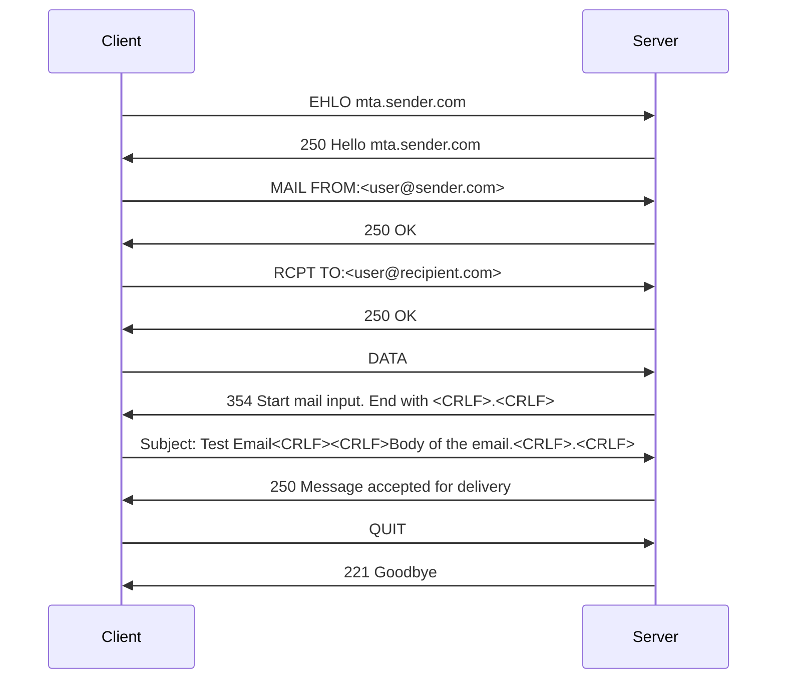

Simple Mail Transfer Protocol (SMTP) is an Internet standard communication protocol for electronic mail transmission.

SMTP is a text-based protocol where clients — be it desktop email clients like Outlook or Thunderbird, or another SMTP server — exchange commands and responses with the target server. When sending an email, the client introduces itself, specifies the sender and recipient, and shares the email content, with the server confirming each step.

