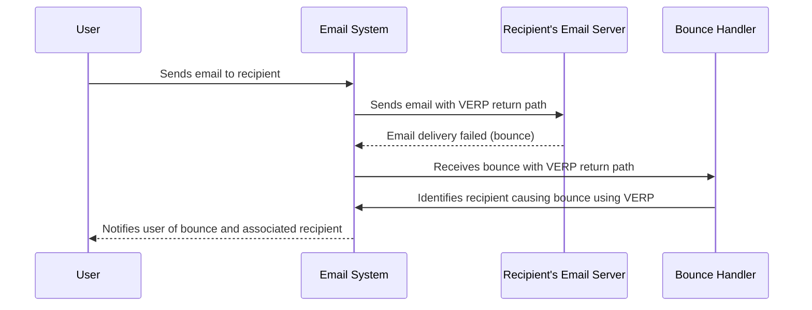

**VERP (Variable Envelope Return Path)** is a technique used in email systems to enable automatic tracking and handling of bounce messages. By using VERP, each outgoing email is assigned a unique return path, allowing the email system to identify and process bounced emails more efficiently.

### How It Works:

When using VERP, the return path of an email (typically the "Return-Path" header) is modified to include unique information about the recipient. This can be done by embedding the recipient's email address or a unique identifier within the return path. If the email bounces, the bounce message will contain this unique return path, allowing the email system to precisely identify which recipient caused the bounce.

### Benefits:

1. **Precision:** VERP allows for accurate identification of bounced emails, even if the bounce message is vague or lacks detailed information.
2. **Automation:** With VERP, email systems can automatically process and categorize bounce messages without manual intervention.
3. **Improved Deliverability:** By promptly addressing and managing bounces, senders can maintain a better sender reputation, leading to improved email deliverability.

### Example:

Without VERP: `Return-Path: noreply@example.com`  
With VERP: `Return-Path: noreply+bob.smith@example.com`

