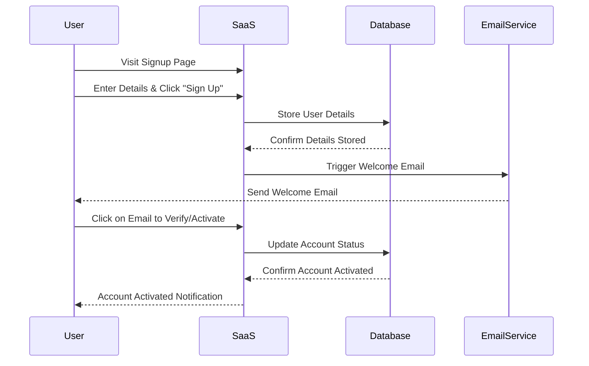

# Example Transaction Flow

The following example illustrates the sequence of events when a user signs up for a service. After entering their details and clicking "Sign Up," the service saves this information in a database. Once stored, a welcome email is dispatched to the user. When the user clicks on this email to verify or activate their account, they receive a final account activation notification. Notably, since this email is directly linked to the user's action of signing up, it's termed a "transactional email."

