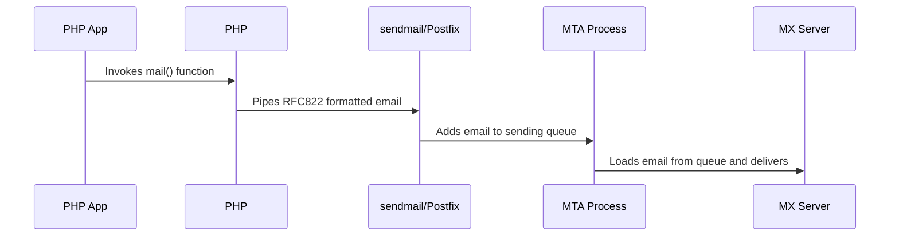

# A Brief History

In earlier times, sending a transactional email was straightforward. All you needed was a simple [`mail()`](https://www.php.net/manual/en/function.mail.php) function call from a PHP script, and voila, your email was dispatched. This function is straightforward, requiring just three inputs: the recipient's address, the subject, and the email content.

```php
<?php
mail(
  "user@example.com",
  "Welcome to our service!",
  "Hello, ${user}! Welcome to our SaaS service!"
);
```

However, fast forward a decade or two, and this simple approach isn't as effective. While the `mail()` function still exists and operates as it always did, its emails often end up in the spam folder or aren't accepted at all. So, what's changed?

:::info

This article mainly focuses on the PHP mail function. But the essence of email sending is consistent, regardless of the language.

:::

So, what exactly does the `mail()` function do? Its operation depends on the server's operating system. On Windows servers, it directs the email to a local SMTP server on port 25. On Linux, PHP sends the function's arguments to the `sendmail` binary. We'll delve deeper into [SMTP](../terms/smtp) in future articles, but for now, let's focus on the use of `sendmail` in Linux.

:::note

Interestingly, just because the executable was labeled `sendmail` doesn't mean it was the Sendmail application. In many instances, it wasn't. More likely, the system ran Postfix, which had a mail delivery executable posing as `sendmail`. While Sendmail is an older mail transfer application still in use today, many Linux distributions have opted for the simpler Postfix app.

:::

Returning to our PHP application: when the `mail()` function is invoked, PHP processes its arguments, compiling an RFC822 formatted email. This information is then piped to the `sendmail` executable. Some function arguments serve as command-line inputs for `sendmail`, while the RFC822 content is piped data.

Finally, the `sendmail` executable adds the email to a sending queue. The system's MTA process then retrieves the email from this queue, attempting to deliver it to the recipient's MX server.



### Understanding the Limitations of the `mail()` Function

While the `mail()` function might seem straightforward, it comes with its own set of challenges.

1. **Simplicity Can Lead to Misuse**: The `mail()` function's simplicity often led to misuse. Consider its third argument, which is for content. If you input plain email text here, it might appear correctly in the sent email. However, this isn't always the case. This argument actually expects a MIME-encoded email structure. Without specifying an encoding, the text is used as-is, but with certain limitations:

   - **ASCII Characters Only**: While some email clients might default to UTF-8 or Win-1257 for 8-bit characters, it's not a guarantee. Using non-ASCII symbols might result in garbled icons instead of the intended text.

   - **Line Length Restrictions**: The recommended line length is 78 bytes, with an absolute maximum of 998 bytes. Exceeding this, especially with script-generated HTML like tables, can lead to email rejection. While modern systems can handle longer lines, they still expect adherence to standards. Emails that don't comply are often flagged as spam.

2. **Handling Attachments**: If you're sending attachments, the content must be in a MIME multipart structure. Crafting multipart messages manually is delicate. Even a minor mistake can corrupt the email or its attachments. While it's possible to do it right, without proper knowledge, the risk of errors increases significantly.

3. **Reputation Concerns**: Emails sent using the `mail()` function are dispatched from the same server where the PHP script is hosted. Often, this server's IP address isn't included in the SPF DNS policy of the sending domain, which can affect the email's deliverability.

4. **Authentication Hurdles**: The MTA daemon on the PHP host, responsible for handling emails, might not be set up to sign emails with DKIM signatures. This can further impact the trustworthiness of the emails sent.

To sum it up, while it's still feasible to use the `mail()` function today, there's a significant risk of system misconfiguration that can hinder its effectiveness.

### The Evolution of Email Sending Libraries

Given the complexities associated with the direct use of the `mail()` function, various libraries were developed to simplify the email sending process. Their primary advantage was the ability to take structured input and generate a valid RFC822 email. These libraries provided flexibility in choosing the delivery method. While the default might still be the `sendmail` command, they also offered options to use SMTP servers, including both unauthenticated relays and authenticated MSA servers.

One of the popular libraries that emerged to address the challenges of the `mail()` function is [PHPMailer](https://github.com/PHPMailer/PHPMailer). Below is an example of how an early version of PHPMailer was used. This snippet achieves the same goal as the PHP code mentioned earlier on this page. However, PHPMailer offers a more structured and less error-prone approach. It ensures correct encodings and even facilitates adding attachments to emails.

:::caution

The code provided below showcases an early version of PHPMailer, intended solely to highlight the transition from the basic `mail()` function to a more sophisticated client library. For contemporary email sending practices with PHPMailer, this example is outdated. Please refrain from using it as a reference for current implementations.

:::

```php
<?php
$mail = new PHPMailer();
$mail->IsSendmail();
$mail->From = "sender@example.com";
$mail->FromName = "Sender Name";
$mail->Subject = "Welcome to our service!";
$mail->AltBody = "To view the message, please use an HTML compatible email viewer!";
$mail->MsgHTML("<p>Hello, ${user}! Welcome to our SaaS service!</p>");
$mail->AddAddress("recipient@example.com", "Recipient Name");
$mail->AddAttachment("images/phpmailer.gif");
$mail->Send();
```
