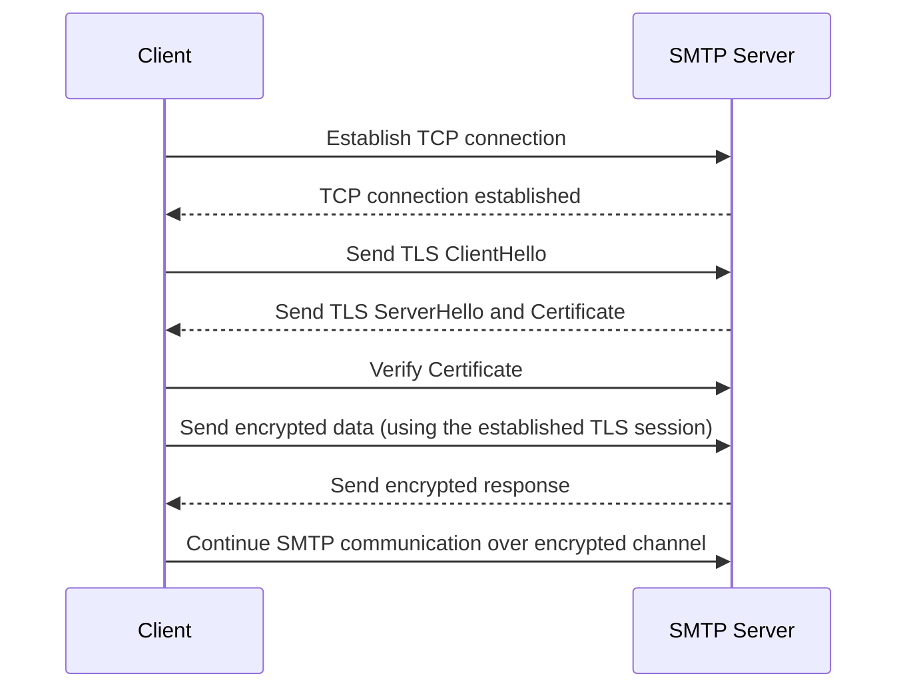
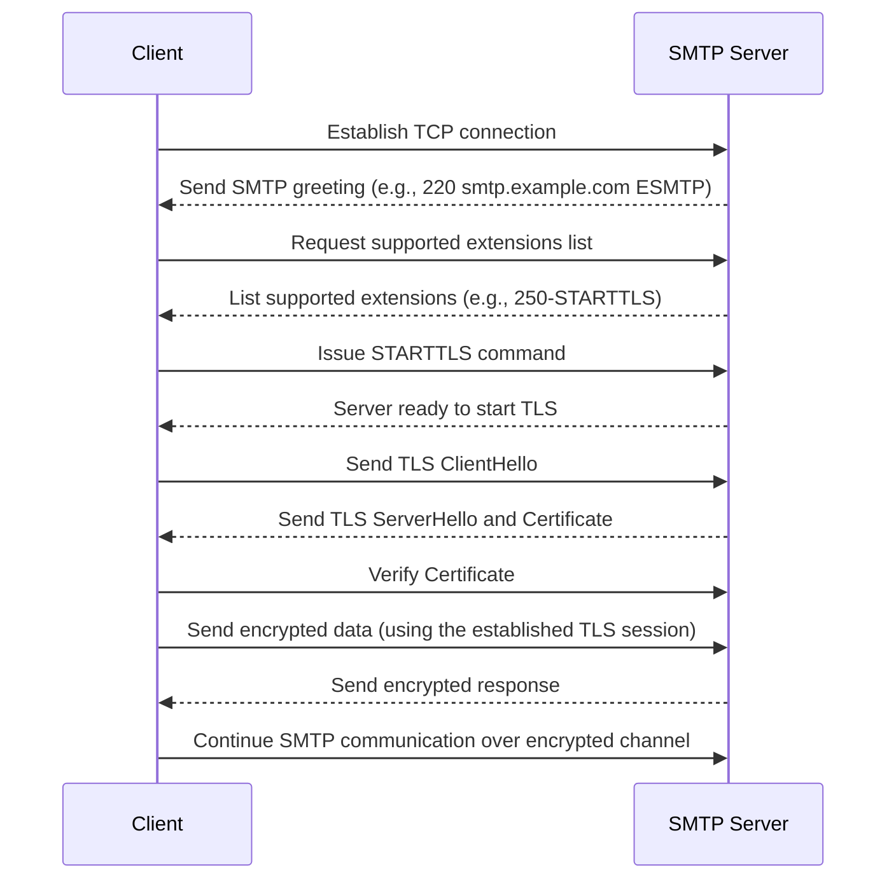

# SMTP Configuration Guide

When integrating transactional emails into your platform, it's crucial to understand the SMTP configuration. While most dedicated email providers will furnish you with the necessary configuration details, it's always beneficial to know the intricacies. Let's delve into the essential configuration options for a seamless SMTP server connection.

## Hostname

The hostname of the SMTP server is pivotal for two primary reasons:

- It's the destination your application connects to for sending emails.
- It serves as the domain name against which the TLS connection is validated. In today's digital age, encountering an SMTP server without TLS is a rarity. When connecting to a TLS server, the client library verifies the server name in the TLS certificate. A mismatch or invalid certificate will lead to a failed connection.

## Port Number

Historically, services utilized port 25. However, this is now earmarked exclusively for MTA/MX traffic. It's imperative not to connect to port 25; if a service provider suggests this, it's advisable to seek an alternative. This is due to the likelihood of this port being blocked, either on the developer's end or in a production environment.

The more prevalent port numbers include 465 and 587 (both standardized for SMTP email sending). In scenarios where default ports are inaccessible, alternatives like 2525 or 2500 might be employed.

## TLS Configuration

The TLS settings can vary based on the chosen port, making it slightly complex due to the STARTTLS protocol. In essence, STARTTLS allows the client library to initiate a non-encrypted connection with the SMTP server. Post a successful SMTP handshake, this connection is elevated to an encrypted TLS connection. Unlike the web where you have a clear distinction between HTTP and HTTPS, here the lines blur.

### TLS

For port 465, the connection is consistently encrypted, mirroring HTTPS. Upon establishing a TCP connection to the SMTP server, the client initiates the TLS handshake. Both parties then use the exchanged information to commence a TLS session. Remember, in this scenario, the client sends the initial bytes post the TCP connection.

### STARTTLS

In contrast, for port 587, the connection starts unencrypted. The server sends an SMTP greeting, and the client requests a list of supported extensions. If `250-STARTTLS` appears on this list, the client activates the STARTTLS command, transitioning the connection to a regular TLS one. Here, the server sends the initial bytes post the TCP connection.

### Potential Issues

The sequence of byte transmission, based on the port and TLS setup, can lead to complications. For instance, connecting to port 465 without TLS can result in a stagnant SMTP connection. This stagnation arises from both the client and server awaiting data from the other, leading to an impasse.

Moreover, developers might mistakenly perceive certain connections as insecure. Even if the initial connection to port 587 is unencrypted, it eventually transitions to TLS. Misconfigurations, like enabling TLS for port 587, can cause simultaneous data transmission from both ends, confusing the systems and causing connection failures.

### Configuring TLS

The configuration varies with the SMTP client library:

- For TLS options like `SSL`, `TLS`, and `none`, use `SSL` for port 465 and `TLS` for port 587.
- For options such as `TLS`, `STARTTLS`, and `none`, select `TLS` for port 465 and `STARTTLS` for port 587.
- If presented with a boolean `secure` or `TLS` option, set it to `true` for port 465 and `false` for port 587.

Configuration can indeed be perplexing. The term "TLS" can have different implications based on the context. Historically, older encrypted TCP connections employed the SSL protocol, while the newer STARTTLS connections adopted the TLS protocol. In contemporary times, SSL has been phased out, with TLS being the standard for all secure connections.

## Credentials

When setting up an SMTP client, one of the critical steps is determining the appropriate authentication method. The choice largely depends on the server and the specific use-case scenario. Here's a breakdown of the common authentication methods:

**Username-Password Pair**:

- **Description**: This is the most straightforward method where the SMTP client provides a username and password to authenticate.
- **Advantage**: Simplicity. Often, with transactional email sending providers, the password is an API key or a specific value generated on the provider's website. The primary benefit is the ease of setup; you only need to store a static value (password) in your configuration.

**OAuth2 Access Token**:

- **Description**: OAuth2 is a more secure method where the SMTP client provides an access token instead of a direct password.
- **Common Use**: Consumer servers like Gmail or MS365 frequently use this method.
- **Advantage**: Enhanced security. The token-based approach ensures that even if someone gains access to the token, they don't have the actual password.
- **Consideration**: The access token typically expires every hour. This means you'll need a mechanism to regenerate these tokens regularly, which can be a bit cumbersome.

**Special Schemes (e.g., NTLM)**:

- **Description**: NTLM (NT LAN Manager) is an authentication protocol.
- **Common Use**: Predominantly used in enterprise setups for internal communications.
- **Advantage**: It offers security benefits in specific enterprise scenarios.
- **Consideration**: Might require more intricate setup and understanding of the internal enterprise infrastructure.

**Final Thoughts**:
The choice of authentication method should align with your security requirements, ease of setup, and the specific email service provider you're working with. While a username-password pair offers simplicity, OAuth2 provides an added layer of security. On the other hand, special schemes like NTLM are more niche and cater to specific enterprise needs. Always ensure that whichever method you choose, it's supported by your SMTP server and aligns with your platform's security guidelines.
