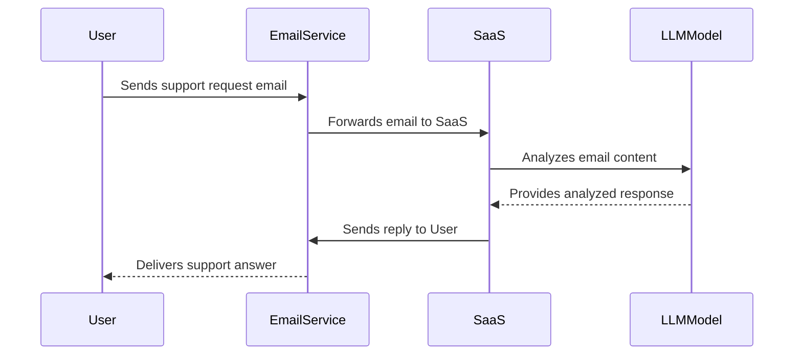

# Example Sending Flow

This flowchart displays the process of a user sending a support request email to a user of a SaaS service. Upon the SaaS service detecting the email, it utilizes an LLM model to analyze its content and subsequently formulates a response. The reply is then sent on behalf of the SaaS service user, ensuring the end recipient perceives the response as coming directly from the user, not the SaaS platform itself.

This type of email sending differs from transactional email in its inherent nature and perception. While transactional emails are typically automated responses triggered by specific user actions, such as account creation or password resets, the emails in this flow are perceived by the recipient as direct communication with the SaaS user.

Furthermore, the sending of the email is contingent upon specific flow conditions being met; in this scenario, only if the LLM successfully formulates an answer. If the LLM fails to generate a response, the email might be redirected to a human agent, adding another layer of conditional complexity that distinguishes it from standard transactional emails.
